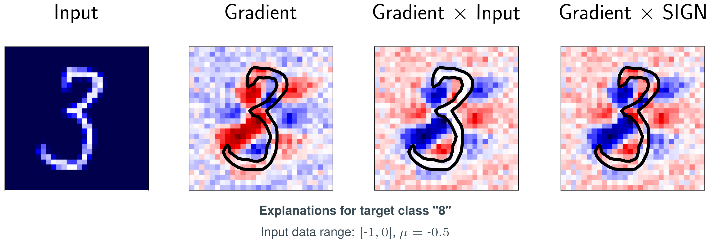
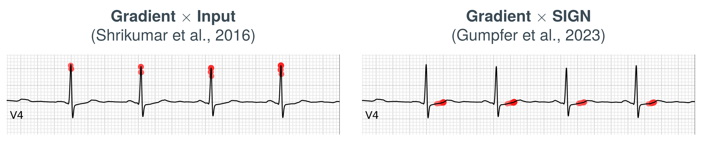

- **Postdoctoral Researcher** at [TimeXAI Research Group](https://www.thm.de/mnd/jennifer-hannig/timexai-erklaerbare-kuenstliche-intelligenz-fuer-zeitreihen) at the [Competence Center for Information Technology](https://www.thm.de/kompetenzzentren/en/kite/profile.html) at [Technische Hochschule Mittelhessen - University of Applied Sciences](https://www.thm.de/site/en/) in Friedberg, Hesse
- **Lecturer** at [THM StudiumPlus Dual Study Programme](https://studiumplus.de/kontakte/nils-gumpfer-10039/), Modules: Machine Learning, Predictive Analytics, Computer Architectures and Operating Systems, Compiler Design

### **Main Research Interest: Enabling Trustworthy and Safe Use of AI in Medical and Industrial Practice**

I am a **postdoctoral researcher** at Technische Hochschule Mittelhessen in Friedberg, Germany. I earned my **Doctor of Engineering** from the Graduate Centre for Engineering Sciences at the Research Campus of Central Hessen in Cooperation with the **Philipps-University of Marburg**. With an industry-earned background in **data analytics**, my research focuses on **applied artificial intelligence in medicine**, particularly in the field of **explainable AI (XAI)** and time series analysis. My scientific contributions include the development of **SIGN, a novel XAI method**, and its evaluation against established clinical guideline patterns. I have also published work on the **detection of myocardial scar** and structural changes in myocardium in general, using **electrocardiogram (ECG)** data. My primary interest lies in **making AI applicable in practice** through the development of **interpretable and transparent models**.

