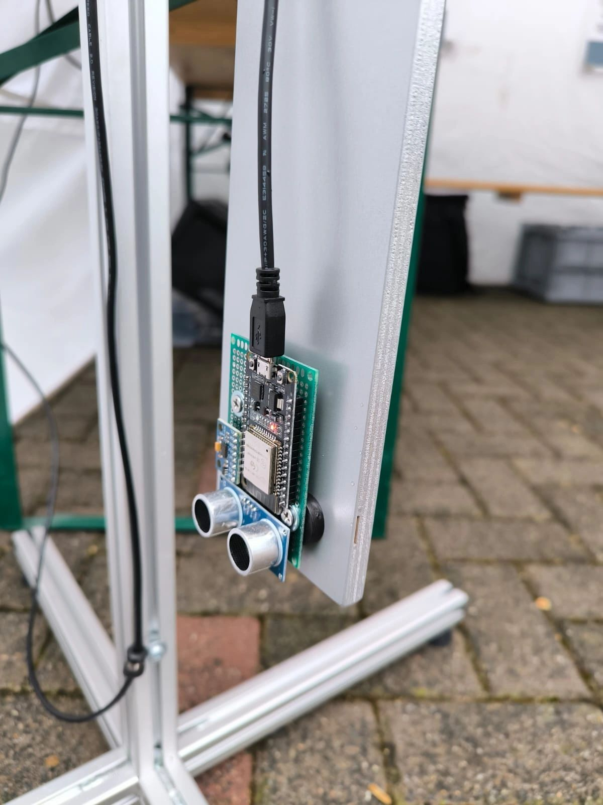
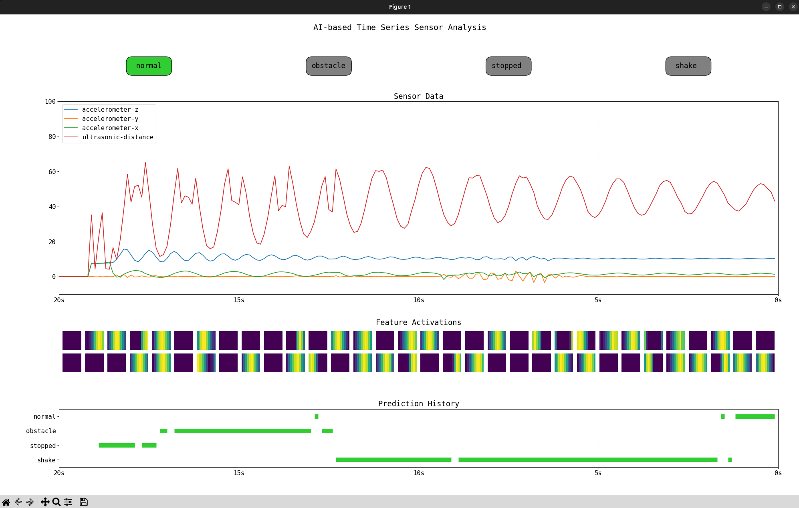
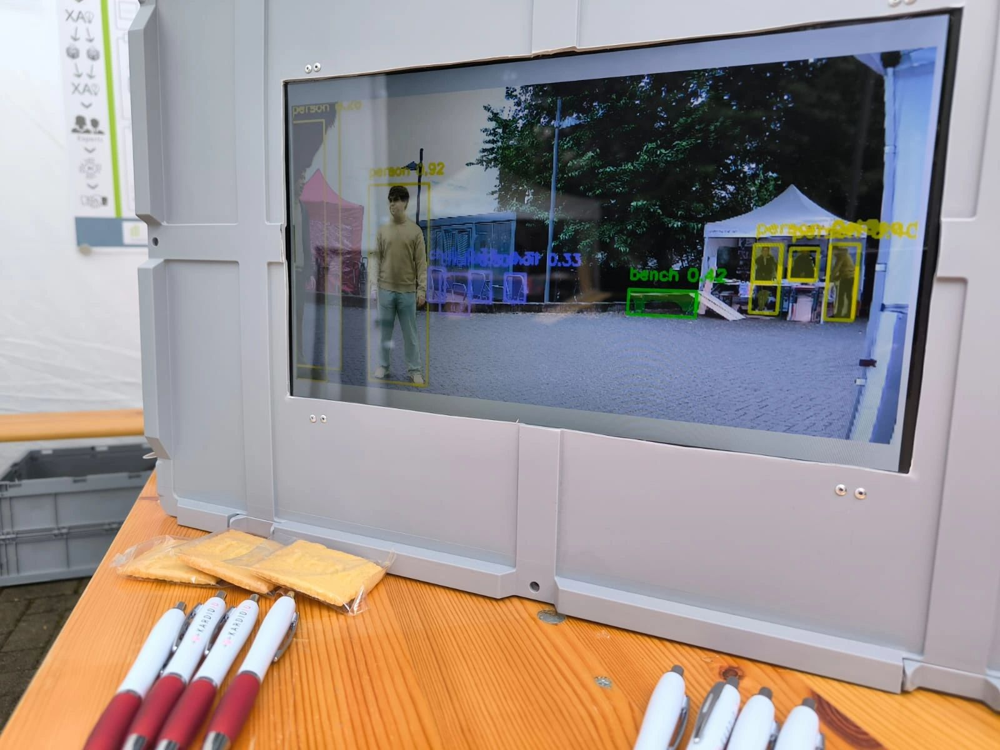
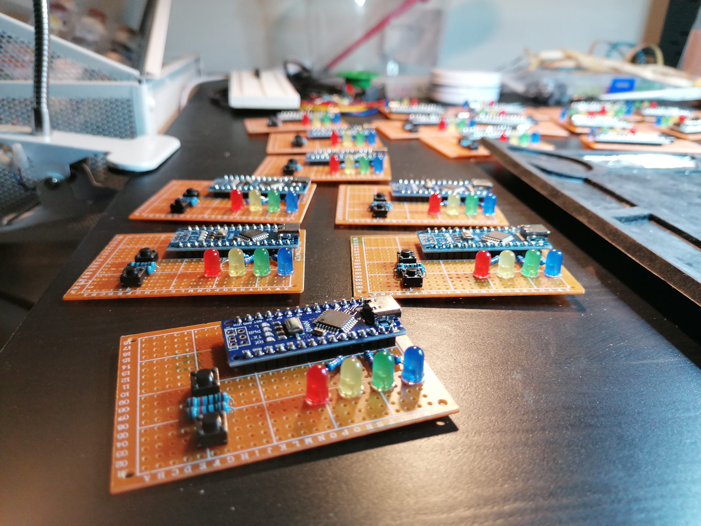



## Contributions to Research Projects (Selective)

**TimeXAI - Explainable Artificial Intelligence for Time Series Classification**
  The TimeXAI project aims to enhance existing and develop novel XAI methods tailored specifically to the domain of time series classification, with strong emphasis on human interpretability of explanations and evaluation thereof. Time series have become primarily important through a growth of sensor-driven applications, but existing explainability methods are largely underdeveloped in this domain. TimeXAI aims to bridge this gap by testing and combining strengths of existing methods and co-creating new ones tailored to domains like cardiology and smart home monitoring. A central goal of the research conducted in this junior research group is the evaluation of XAI quality through eye-tracking studies with domain experts. [Learn more](https://www.thm.de/mnd/jennifer-hannig/timexai-erklaerbare-kuenstliche-intelligenz-fuer-zeitreihen)

**Time frame**: 09/2024 - 08/2027

**Funding**: ExperTeam4KI, Federal Ministry of Research, Technology and Space (01IS24063)

**Lead**: [Prof. Dr. Jennifer Hannig (Technische Hochschule Mittelhessen)](https://www.thm.de/mnd/jennifer-hannig)

**My role**: As a postdoctoral researcher, I guide the research and development of time series XAI techniques, supervise PhD students, and support in designing appropriate evaluation strategies.

---

**SUSTAIN‑AI ECG / ECG4Africa.org - AI‑Enhanced ECG Diagnostics for Africa**
  As a collaboration lead by MI4People, this project aims to deploy AI‑powered ECG analysis tools in regions with limited access to cardiology expertise, starting in Ethiopia, where cardiovascular disease is highly prevalent and local diagnostics are scarce. The focus lies on developing interpretable models to detect cardiac anomalies using 12‑lead ECGs, optimizing them for deployment in resource‑limited clinical settings and establishing an african dataset for fine-tuning AI models for ECG analysis. [Learn more](https://mi4people.org/sustain-ai-ecg)
  
**Time frame**: 01/2025 - ongoing

**Funding**: Fundraising, supported by Bavarian State Chancellery, Armauer Hansen Research Institute and Technische Hochschule Mittelhessen 

**Lead**: [MI4People gGmbH](https://www.mi4people.org/)

**My role**: Development and training of AI models, for diagnostic analysis, integration of explainability methods, practical evaluation under field‑testing conditions, full-stack development of web application.

---

**X4Neuro - XAI for Digital Neuropathology**  
  Meningiomas are traditionally analyzed through complex laboratory analysis. The X4Neuro project aims to extend an existing AI model for epigenetic classification of digitized histopathological slides with explainable AI techniques. The goal is to identify and visualize the cellular- or pixel-level regions that are most relevant to the model's decision, thereby increasing clinical interpretability and trust. [Learn more](https://www.thm.de/mnd/jennifer-hannig/x4neuro-xai-for-digital-neuropathology)
  
**Time frame**: 10/2024 - 03/2026

**Funding**: Hessian Ministry of Science and Research, "Experimentierräume"

**Lead**: Justus-Liebig-University of Giessen, Technische Hochschule Mittelhessen

**My role**: Development and training of the classification model, integration of XAI methods for pixel-level heatmaps, and evaluation of interpretability in practical pathology settings.

---

**BPEAX - AI-based detection of exaggerated blood pressure response to exercise based on central blood pressure estimates and ECG data** 
  The research objective of BPEAX is the development of an artificial neural network for the prediction of exercise-induced hypertension in people with normal resting blood pressure values based on ECG data and/or central blood pressure curves. [Learn more](https://www.thm.de/mnd/jennifer-hannig/x4neuro-xai-for-digital-neuropathology)
  
**Time frame**: 05/2024 - 10/2025

**Funding**: Hessian Ministry of Science and Research, "Experimentierräume"

**Lead**: Technische Hochschule Mittelhessen, Justus-Liebig-University of Giessen

**My role**: Guidance of AI model development and application, XAI-based analysis and interpretation of model behavior and pattern usage in blood pressure curves.

---

**HERMIQS - Heart Emergency Rescue Management IQ System**  
  HERMIQS aims to improve emergency response workflows for cardiac incidents through intelligent systems. The project develops real-time, AI-powered tools to assist paramedics and physicians during pre-hospital and early in-hospital care. Key research areas include the integration of wearable sensor data, decision support under time-critical conditions, and explainability of AI outputs in emergency contexts. The project explores how trustworthy AI can contribute to faster, more accurate diagnosis and better patient outcomes during the so-called "golden hour" of cardiac emergencies. [Learn more](https://www.lidia-hessen.de/projekte-entdecken/hermiqs-heart-emergency-rescue-management-iq-system/)
  
**Time frame**: 10/2022 - 09/2025

**Funding**: Distr@l 2A, Hessian Ministry of Digitalization and Innovation

**Lead**: CRS medical GmbH, Technische Hochschule Mittelhessen, Justus-Liebig-University of Giessen

**My role**: Development and training of AI models for real-time analysis, integration of explainability methods, and evaluation of model performance in emergency decision-making scenarios.  

---

**RisKa - Risk Stratification in Cardiology Using AI**  
  The RisKa project focuses on developing advanced AI models to enable early and individualized risk stratification in cardiology. The goal is to analyze ECG signals alongside clinical parameters to identify patients at elevated risk of severe cardiac events such as sudden cardiac arrest or worsening heart failure. Research emphasis includes interpretable deep learning methods that clinicians can trust, bridging the gap between algorithmic performance and real-world applicability. The project is interdisciplinary, involving experts in cardiology, data science, and explainable AI (XAI). [Learn more](https://www.lidia-hessen.de/projekte-entdecken/riska-risikostratifizierung-in-der-kardiologie-mittels-ki/)

**Time frame**: 05/2022 - 04/2024

**Funding**: Distr@l 4A, Hessian Ministry of Digitalization and Innovation

**Lead**: Technische Hochschule Mittelhessen, Justus-Liebig-University of Giessen

**My role**: Development and training of AI models, implementation of explainability methods, and practical evaluation of the approaches in clinical contexts.

## Science Communication and Teaching (Selective)
 
**Time Series Pendulum**  
  The _Time Series Pendulum_ illustrates the process and circumstances of time series generation, recording and analysis, as it can be found in industrial applications, smart home environments, wearable devices, etc. - We used a basic 1D CNN to showcase the underlying pattern analysis structures to obtain accurate classification of pendulum states. [Git-Repo](https://gitlab.com/nilsgumpfer/pendulum-timeseries)

---

**YOLO Box**  
  With the _YOLO Box_, object detection, segmentation, and classification capabilities of deep learning models can easily be understood using live webcam feeds. [Git-Repo](https://gitlab.com/nilsgumpfer/yolo-demo)

---

**Arduino Board**  
  The _Arduino Board_ is used in teached courses, e.g., _operating systems_ or _fundamentals of computer science_. The board allows to experience embedded programming and understanding basic computer science principles with hands-on exercises.

