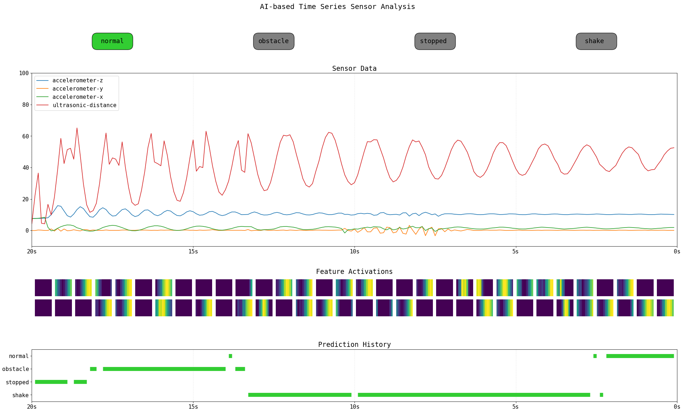



## Research Projects (Selective)

**RisKa – Risk Stratification in Cardiology Using AI**  
  The RisKa project focuses on developing advanced AI models to enable early and individualized risk stratification in cardiology. The goal is to analyze ECG signals alongside clinical parameters to identify patients at elevated risk of severe cardiac events such as sudden cardiac arrest or worsening heart failure.  
  Research emphasis includes interpretable deep learning methods that clinicians can trust, bridging the gap between algorithmic performance and real-world applicability. The project is interdisciplinary, involving experts in cardiology, data science, and explainable AI (XAI).  

**Time frame**: 05/2022 - 04/2024

**Funding**: Distr@l 4A, Hessian Ministry for Digitalization and Innovation

**Lead**: Technische Hochschule Mittelhessen, Justus-Liebig-University of Giessen

**My role**: Development and training of AI models, implementation of explainability methods, and practical evaluation of the approaches in clinical contexts.  
  [Learn more](https://www.lidia-hessen.de/projekte-entdecken/riska-risikostratifizierung-in-der-kardiologie-mittels-ki/)

---

**HERMIQS – Heart Emergency Rescue Management IQ System**  
  HERMIQS aims to improve emergency response workflows for cardiac incidents through intelligent systems. The project develops real-time, AI-powered tools to assist paramedics and physicians during pre-hospital and early in-hospital care.  
  Key research areas include the integration of wearable sensor data, decision support under time-critical conditions, and explainability of AI outputs in emergency contexts. The project explores how trustworthy AI can contribute to faster, more accurate diagnosis and better patient outcomes during the so-called "golden hour" of cardiac emergencies.  
  
**Time frame**: 10/2022 - 09/2025

**Funding**: Distr@l 2A, Hessian Ministry for Digitalization and Innovation

**Lead**: CRS medical GmbH, Technische Hochschule Mittelhessen, Justus-Liebig-University of Giessen

**My role**: Development and training of AI models for real-time analysis, integration of explainability methods, and evaluation of model performance in emergency decision-making scenarios.  
  [Learn more](https://www.lidia-hessen.de/projekte-entdecken/hermiqs-heart-emergency-rescue-management-iq-system/)

---

**X4Neuro**

---

**BPEAX**

## Science Communication (Selective)
 
**Time Series Pendulum**

The _Time Series Pendulum_ illustrates the process and circumstances of time series generation, recording and analysis, as it can be found in industrial applications, smart home environments, wearable devices, etc. - We used a basic 1D CNN to showcase the underlying pattern analysis structures to obtain accurate classification of pendulum states.

---

**YOLO Box**

With the _YOLO Box_, object detection, segmentation, and classification capabilities of deep learning models can easily be understood using live webcam feeds.

---

**Arduino Board**

The _Arduino Board_ is used in teached courses, e.g., _operating systems_ or _fundamentals of computer science_. The board allows to experience embedded programming and understanding basic computer science principles with hands-on exercises.
